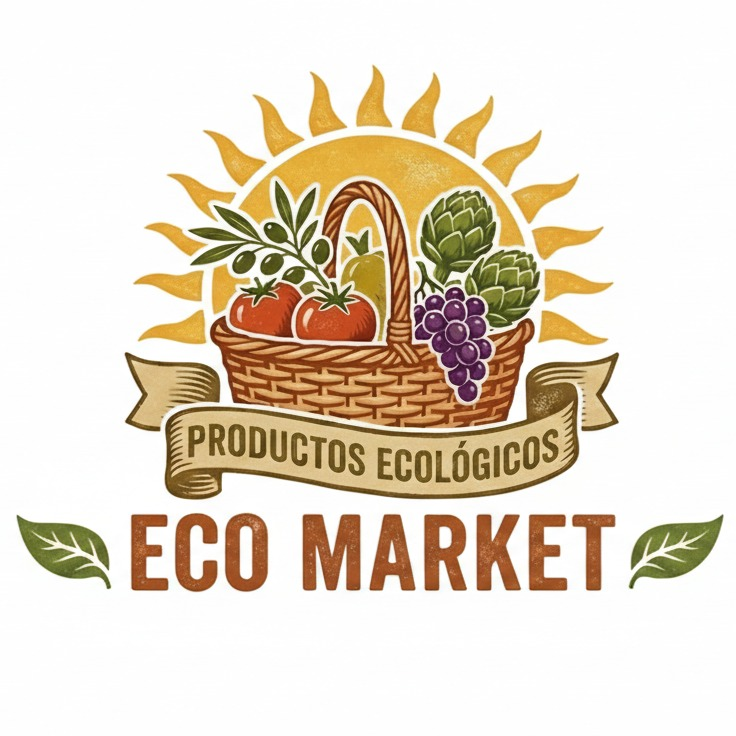

# Eco Market

   

## Integrantes del Grupo
* Alejandro David Fariña Afonso
* Jorge Suárez Báez
* Nauzet Martel Rodríguez
* Paola Viera Suárez

---

## Evolución del Proyecto (Sprint 3)
En este sprint, hemos migrado nuestra aplicación a un stack moderno utilizando Angular como framework de frontend. Además, hemos reemplazado la fuente de datos local por un backend completo en la nube mediante la plataforma Firebase.

---

## Estructura del Código (Angular)
El proyecto ha sido refactorizado en componentes modulares y servicios inyectables siguiendo las mejores prácticas de Angular.

### Componentes Principales
* **Templates (`header` y `footer`):** Contienen la navegación principal y el pie de página. El header integra la lógica del carrito de compras y la visibilidad de opciones según el estado de la sesión.
* **`inicio`:** Página de aterrizaje (Landing Page) estática que presenta el proyecto y redirige al catálogo o a la sección de productores.
* **`catalogo`:** Muestra la lista de productos disponibles, consumiendo los datos directamente del servicio de productos. Incluye filtros dinámicos (categoría, provincia, precio) y botones para añadir al carrito.
* **`detalle`:** Vista ampliada de un producto específico, recuperando su información mediante el ID pasado por la ruta.
* **`productores` y `contacto`:** Páginas informativas. El formulario de contacto utiliza `ReactiveFormsModule` para validaciones nativas y envía los mensajes directamente a Firebase.
* **`login` y `registro`:** Formularios validados nativamente en Angular que gestionan la entrada de credenciales y la creación de cuentas interactuando con el servicio de autenticación.
* **`perfil`:** Panel de usuario cliente que permite visualizar y editar los datos personales (teléfono, dirección, nombre) guardados en la base de datos en tiempo real.
* **`panel-productor`:** Área exclusiva para usuarios con rol de productor. Permite realizar un CRUD completo (Crear, Leer, Actualizar, Borrar) de sus productos y gestionar la subida de imágenes.

> [!NOTE]
>
> En este sprint hemos definido un sistema de usuarios en el que sólo es posible registrarse como CLIENTE, ya que nuestro equipo debe validar a cada productor que quiera darse de alta para evitar a posibles estafadores. Por ello, nosotros somos los únicos que podemos otorgar a los usuarios el rol PRODUCTOR desde nuestra base de datos. Si lo desea, tiene disponible un usuario PRODUCTOR de prueba con las siguientes credenciales:
>
> * **Usuario:** `productor@gmail.com`
> * **Contraseña:** `123456`

### Servicios (`services/`)
* **`auth.service.ts`:** Conecta la aplicación con el servicio de autenticación de Firebase (Firebase Authentication) para el registro y login. Mantiene un `BehaviorSubject` para propagar el estado de la sesión por toda la app.
* **`product.service.ts`:** Gestiona la comunicación con la base de datos para obtener, crear, modificar y eliminar productos. También se encarga de subir las imágenes al almacenamiento en la nube antes de guardar el registro.
* **`cart.service.ts`:** Administra el carrito de compras, guardando los artículos temporalmente en una subcolección dentro del perfil del usuario en la base de datos.

---

## Estructura de Datos en Firebase
Para este sprint, el contenido dinámico y la gestión de usuarios se han migrado completamente a Firebase, permitiendo una sincronización en tiempo real y almacenamiento en la nube.

### 1. Firebase Authentication
Gestiona las credenciales de los usuarios (Email y Contraseña) de forma segura, asignando un identificador único (`UID`) a cada cuenta.

### 2. Firestore Database (Base de datos NoSQL)
La información se organiza en colecciones y documentos:

* **Colección `users`**: Almacena los perfiles extendidos de los usuarios. El ID del documento coincide con el `UID` de Firebase Auth.
  * **Campos:** `name` (String), `email` (String), `rol` ("CLIENTE" o "PRODUCTOR"), `provincia` (String), `telefono` (String), `direccion` (String).
* **Colección `products`**: Almacena todos los productos del marketplace. Los productos son de lectura pública, pero solo los productores autenticados pueden escribirlos.
  * **Campos:** `name` (String), `description` (String), `origin` (String), `price` (Number), `unit` (String), `quantity` (Number), `verification_status` (String: "VERIFICADO"), `image_url` (String - Enlace público de Storage), `ownerId` (String - UID del productor), `ownerName` (String).

### 3. Firebase Storage
Las imágenes seleccionadas por los productores en su panel se guardan de forma segura en Firebase Storage.
* **Ruta de guardado:** `/products/img_[timestamp]_[nombre_archivo]`.
* **Sincronización:** Una vez subido el archivo, Firebase Storage devuelve una URL pública que se almacena automáticamente en el campo `image_url` de la base de datos del producto.

---

## Tour por la Aplicación Web
En el siguiente vídeo demostrativo realizamos un recorrido por los puntos más importantes de EcoMarket, mostrando la funcionalidad completa de la integración con Angular y Firebase.

**[Ver vídeo de demostración en YouTube](https://youtu.be/-o2cIsQCuhw)**
